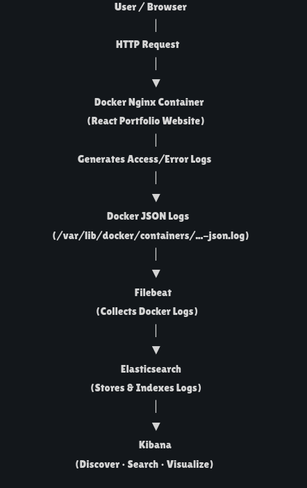
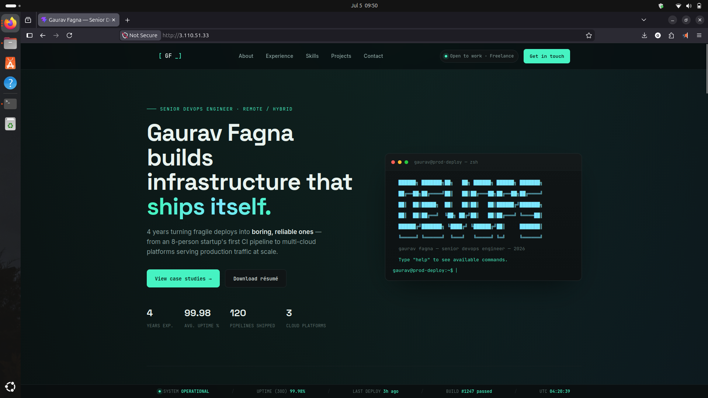
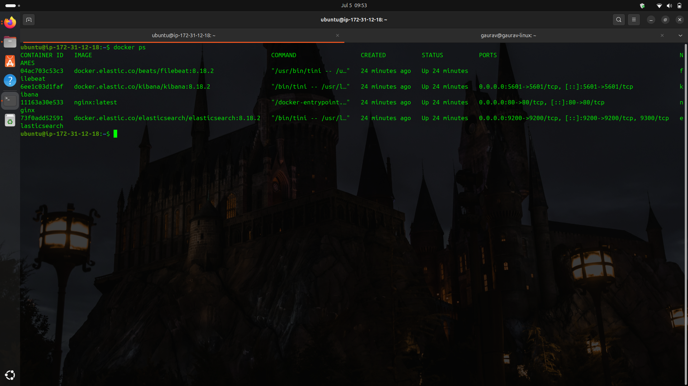
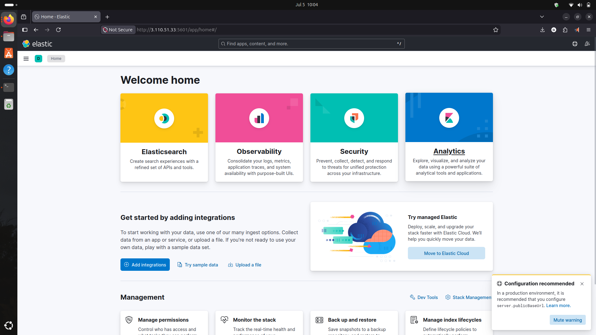
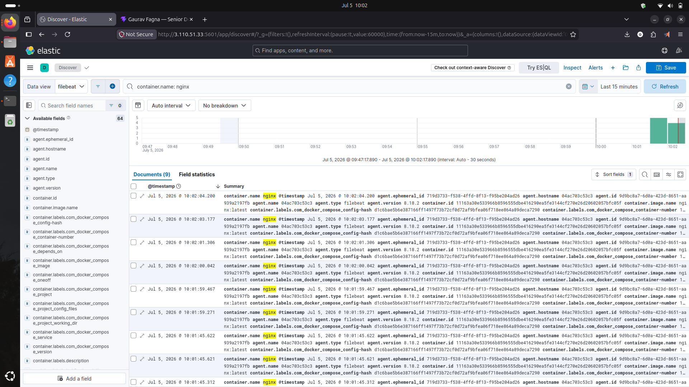

# ELK Stack Monitoring with Docker, Filebeat & Nginx

## Project Overview

This project demonstrates a centralized log monitoring solution using the ELK Stack (Elasticsearch, Kibana) with Filebeat and Nginx. Logs generated by the Nginx web server are collected by Filebeat, stored in Elasticsearch, and visualized in Kibana for real-time monitoring and analysis.

The entire environment is containerized using Docker Compose, making deployment simple and reproducible.

---

# Architecture

```
                    User
                      │
                      ▼
             +----------------+
             |     Nginx      |
             | Static Website |
             +----------------+
                      │
               Container Logs
                      │
                      ▼
             +----------------+
             |    Filebeat    |
             | Log Collector  |
             +----------------+
                      │
                      ▼
             +----------------+
             | Elasticsearch  |
             | Store & Search |
             +----------------+
                      │
                      ▼
             +----------------+
             |    Kibana      |
             | Visualization  |
             +----------------+
```

---

# Features

- Centralized log monitoring
- Docker Compose deployment
- Nginx container log collection
- Filebeat log shipping
- Elasticsearch indexing
- Kibana visualization
- Real-time log analysis
- Easy deployment

---

# Tech Stack

- Docker
- Docker Compose
- Elasticsearch 8.18.2
- Kibana 8.18.2
- Filebeat 8.18.2
- Nginx
- Ubuntu Linux

---

# Project Structure

```
elk-stack-monitoring/
│
├── docker-compose.yml
├── README.md
├── .gitignore
│
├── filebeat/
│   └── filebeat.yml
│
├── nginx/
│   └── html/
│       ├── index.html
│       ├── assets/
│       ├── favicon.svg
│       └── icons.svg
│
├── screenshots/
│   ├── architecture.png
│   ├── website.png
│   ├── docker-ps.png
│   ├── kibana-home.png
│   └── discover.png
│
└── docs/
    ├── architecture.md
    └── installation.md
```

---

# Prerequisites

Before running this project, install:

- Docker
- Docker Compose
- Git

---

# Installation

### Clone Repository

```bash
git clone https://github.com/Gravv-dev/elk-stack-monitoring.git
```

### Move into the project directory

```bash
cd elk-stack-monitoring
```

### Start all containers

```bash
docker compose up -d
```

### Verify running containers

```bash
docker ps
```

---

# Access the Application

### Website

```
http://YOUR_EC2_PUBLIC_IP
```

### Kibana

```
http://YOUR_EC2_PUBLIC_IP:5601
```

### Elasticsearch

```
http://YOUR_EC2_PUBLIC_IP:9200
```

---

# Useful Commands

### Start Containers

```bash
docker compose up -d
```

### Stop Containers

```bash
docker compose down
```

### Restart Containers

```bash
docker compose restart
```

### View Logs

```bash
docker compose logs -f
```

### Running Containers

```bash
docker ps
```

---

# Screenshots

## Architecture



## Website



## Docker Containers



## Kibana Home



## Discover Logs



---

# Future Improvements

- Logstash integration
- Metricbeat monitoring
- Grafana dashboard integration
- HTTPS with SSL
- Authentication and security
- CI/CD pipeline deployment

---

# Documentation

Additional documentation is available in the **docs/** directory.

- architecture.md
- installation.md

---

# Author

**Gaurav Fagna**

Junior DevOps Engineer

GitHub: https://github.com/Gravv-dev

---

⭐ If you found this project useful, consider giving it a Star.
